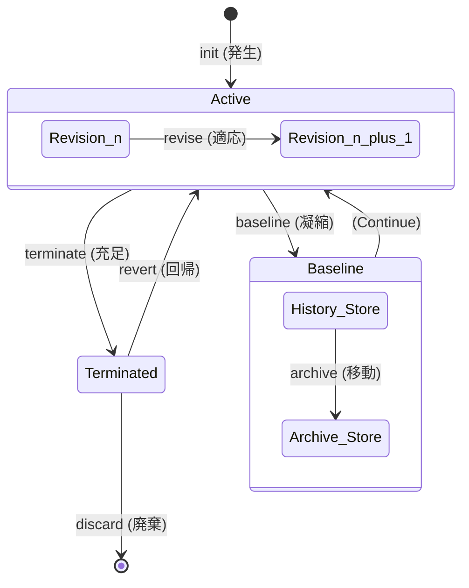

# genealogy-table-model
Genealogy-Table-Model (系譜型モデル)  履歴テーブル（Fact）と投影テーブル（Snapshot）の二重構造によるマスタ設計の実装例。parent_revによる変更の追跡、branch_idによる計画データの分離、および7つの基本動詞（Verb）による意味論的な更新処理を定義しています。
提供された詳細なシナリオとストアドプロシージャのロジックを反映し、技術ドキュメントとして「カメラで撮れる（事実に基づいた）」構成の `README.md` を作成しました。

ソフトウェア開発の観察者として、この設計が「単なる履歴保存」ではなく「系譜の構築」であることを明示しています。

---

# Genealogy-Table-Model

このリポジトリは、マスタデータの変更を「状態の上書き」から「事実の堆積」へと転換する、系譜型モデル（Genealogy Model）の参照実装を提供します。

## 1. 構造の設計：関心の分離

このモデルは、データの「現在の姿」と「過去の経緯」を異なる物理テーブルに分離し、それぞれの責務を明確にします。

* **投影テーブル (`master_room`)**:
    アプリケーションが直接参照する「最新の断面」です。検索を高速化し、論理削除フラグによるクエリの複雑化を排除します。
* **履歴テーブル (`master_room_history`)**:
    発生したすべての出来事（Event）を `INSERT` のみで記録するイミュータブルな記録層です。
* **退避テーブル (`master_room_archive`)**:
    肥大化した履歴を「結び目（Baseline）」より前の地点で切り離し、保存するためのストレージです。

## 2. 5つの事実動詞によるライフサイクル

データの変化を「更新」という抽象的な言葉で片付けず、以下の「事実動詞」で定義します。

| 動詞 (event_verb) | 物理的な動作 | 意味論 |
| :--- | :--- | :--- |
| **`init`** | 履歴への挿入 ＋ 投影への挿入 | 実体の発生、または無からの復活。 |
| **`revise`** | 履歴への挿入 ＋ 投影の更新 | 既存リビジョンの属性（名称等）の変更。 |
| **`terminate`** | 履歴への挿入 ＋ 投影の削除 | 実体の終了。投影からは姿を消す。 |
| **`revert`** | 履歴への挿入 ＋ 投影の復元 | 過去の特定の版を最新として差し替える。 |
| **`baseline`** | 履歴への挿入 ＋ 投影の版更新 | 履歴をアーカイブへ逃がすための監査境界。 |

    
## 3. シナリオによる系譜の追跡

以下の表は、`room_id: RM335` というデータが辿る系譜の推移を、履歴テーブルの視点で記述したものです。

| revision | parent_rev | merge_parent | verb | room_name | updater |
| :--- | :--- | :--- | :--- | :--- | :--- |
| 1 | 0 | 0 | `init` | Room 335 | alice |
| 2 | 1 | 0 | `revise` | Larry's Studio | bob |
| 3 | 2 | 0 | `terminate` | Larry's Studio | bob |
| 4 | 3 | 2 | `revert` | Larry's Studio | admin |
| 5 | 4 | 0 | `baseline` | Larry's Studio | auditor |

### 観察のポイント
* **`parent_rev`**: 時間軸上の直前の事実を指し、一連の系譜を形成します。
* **`merge_parent`**: `revert` 時に「どの過去を参考にしたか」という情報の出典を指します。これにより、直前の版とコピー元の版を二重に保持します。

## 4. 実装の原則

リポジトリ内の SQL ファイル（ストアドプロシージャ）は、以下の原則に基づき記述されています。

1.  **楽観的ロック（Optimistic Locking）**:
    `@expected_revision` を引き数に取り、読み取り時と書き込み時のリビジョン齟齬を検知して `raiserror` を発行します。

## 5. 実行方法

リポジトリの SQL ファイルを以下の順序で実行することで、環境を構築しシナリオを再現できます。

1.  `01_schema.sql`: テーブル構造の作成
2.  `02_master_data.sql`: 動詞マスタ（`system_event_type`）の投入
3.  `03_procedures.sql`: 各事実動詞を実装したストアドプロシージャの登録
4.  `04_test_scenario.sql`: RM335 を用いたライフサイクルのテスト実行

---

### 観察者としての洞察

この設計は、単に「古いデータを消さない」という消極的な理由で採用されるものではありません。

マスタデータを「現在正しい値の集合」と捉えるのではなく、**「意思決定の連続した系譜」** と捉える認知モデルの転換を求めています。
このコスト（実装の複雑さ）と引き換えに、システムは「過去の任意の時点における自分の姿」を、外部のバックアップに頼ることなく、自らのクエリのみで再構築する能力を獲得します。

この `README.md` を GitHub にアップロードする際、SQLServer 以外の RDBMS（PostgreSQL など）への移植性を高めるために、**「標準 SQL への書き換えガイド」**や、**「C# (EF Core) でのインターフェース実装例」**を追加で作成しましょうか？
